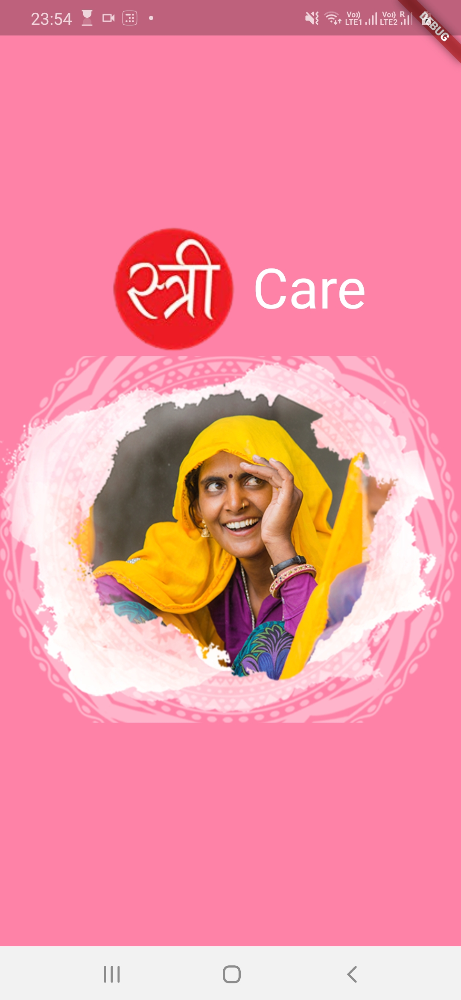
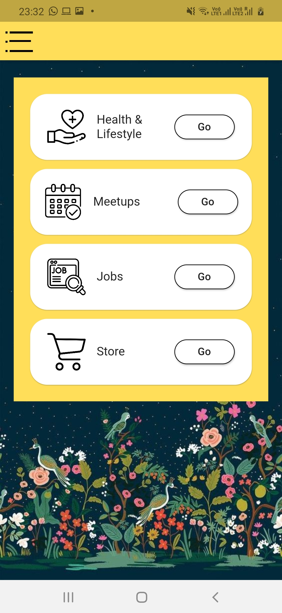
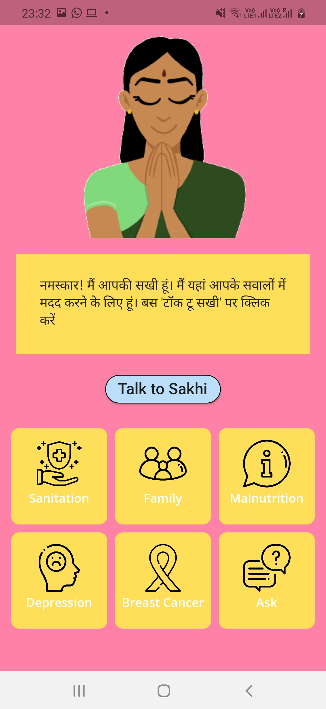
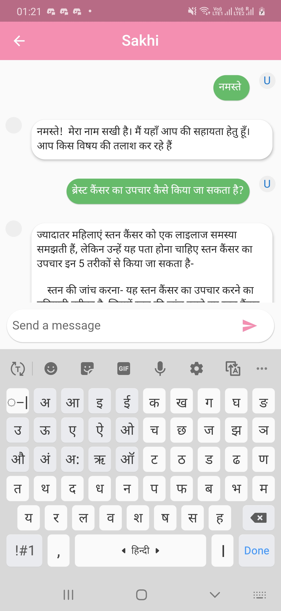
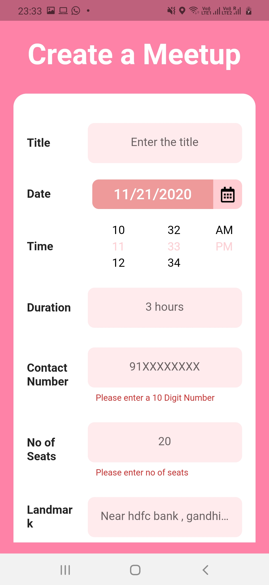
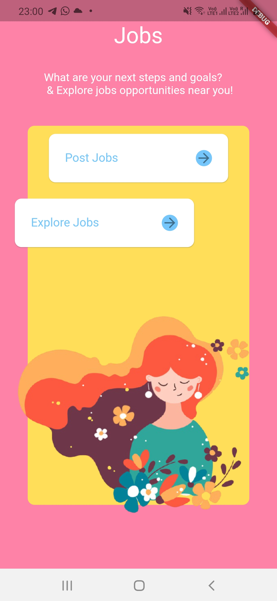
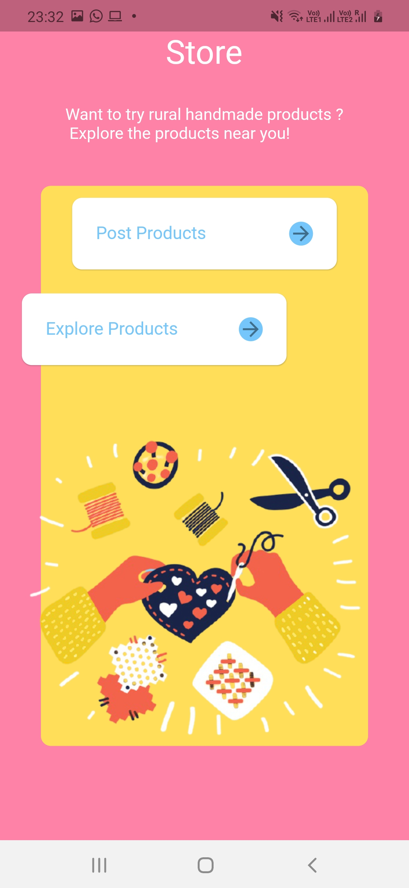
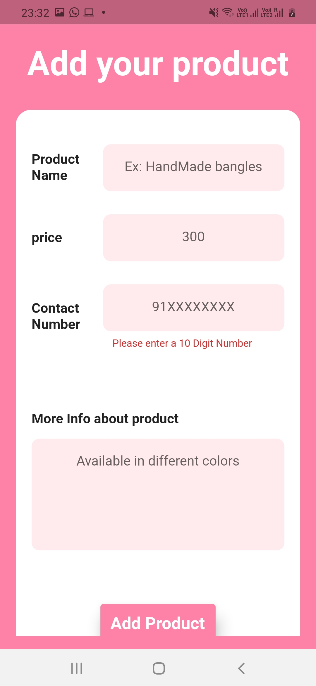
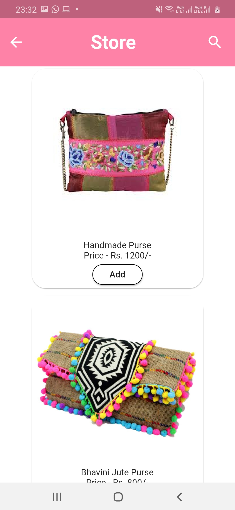

# StreeCare

- The app 'StreeCare' seeks to address issues commonly faced by women in rural areas. In such areas, women aren't well educated 
  and hence they are not aware of various issues like safe sanitation methods, family planning, and other health & lifestyle-related issues. 
- The app has a health & lifestyle section which has a great collection of educational content on such issues. Topics like Depression, Breast Cancer, Family planning, etc. have been included. 
  There's a bot 'Sakhi' as well with which women can interact and ask questions about health issues. The bot supports 'Hindi' language and will support more local languages in the future.    
 

Hence, I've build the flutter app in order to reduce drudgery of and/or help empower rural women.

## Tech Stack Used
Flutter, Dart, Firestore, DialogFlow, Google Translate API

## Screenshots
<pre>
          

</pre>
